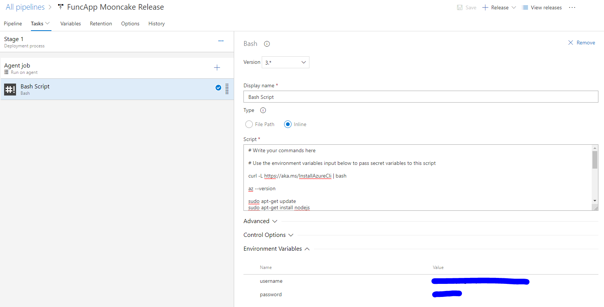

## This is an experiment project to deploy Azure function from AzureDevOps to China Azure

#### To make it simple in the release pipeline, there is only one Bash Job and the Bash script is in this README file.

Azure CLI is a tool to mamange the Azure resource. and it can switch to different Azure cloud.

This command will show the Azure Cloud
    
    az cloud list --output table

This Command will switch to Azure China
    
    az cloud set --name AzureChinaCloud

Then use the following command to login your Azure China 
    
    az login -u <usr> -p <pwd>

Here is the full Bash script to deploy a function app from git to Azure China. And in Azure DevOps, it can be pasted in the script textbox.


```bash
# Write your commands here

# Use the environment variables input below to pass secret variables to this script

curl -L https://aka.ms/InstallAzureCli | bash

az --version

sudo apt-get update
sudo apt-get install nodejs
sudo apt-get install npm

npm install -g azure-functions-core-tools

az cloud set --name AzureChinaCloud

az login -u $username -p $password

az group create --name myFuncAppGroup --location chinanorth

az storage account create --name myfuncappstorage  --location chinanorth --resource-group myFuncAppGroup --sku Standard_LRS

az functionapp create  --name mooncakehttpfunc --storage-account myfuncappstorage --plan myFuncAppPlan  --resource-group myFuncAppGroup  --deployment-source-url https://github.com/maye-msft/funcapp-devops-chinaazure --deployment-source-branch master

```



_App Service plan need to be created before the function app deploying._